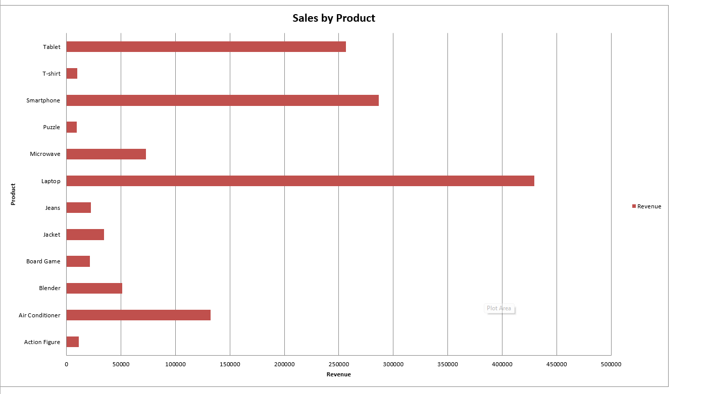
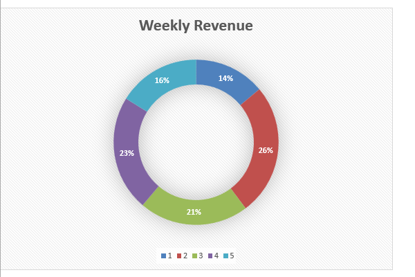

# 📊 Excel Report Generator

Automatically generate insightful Excel reports from sales data using Python.


---

## 📝 Project Overview

This script reads raw sales data from an Excel file and generates a fully formatted report that includes:

- ✅ Summary of total revenue, total orders, and units sold
- 📆 Weekly sales breakdown (transposed and visualized)
- 📈 Automatically created bar charts using `openpyxl`
- 🧼 Clean formatting with custom width, height, and layout

This is ideal for business analysts, Excel automation freelancers, or internal reporting.

---

## 🧰 Tech Stack

- **Python 3.10+**
- `pandas`
- `openpyxl`
- `datetime`

---

## 📂 Folder Structure

```
Excel_Report_Generator/
├── Excel_Report_Generator.ipynb     # Jupyter Notebook (main logic)
├── sales_data.xlsx                  # Sample sales data file
├── Images/                          # Screenshot previews
│   ├── image1.png
│   ├── image2.png
│   ├── image3.png
│   ├── image4.png
│   ├── image5.png
│   ├── image6.png
│   └── image7.png
└── README.md                        # This file
```

---

## ▶️ How to Use

### 🛠 Requirements

Install the required packages:
```bash
pip install pandas openpyxl
```

### 🚀 Steps

1. Clone this repo or download the files.
2. Open `Excel_Report_Generator.ipynb` in Jupyter Notebook or VS Code.
3. Replace `sales_data.xlsx` with your own file (same column structure).
4. Run all cells.
5. Output Excel file with summaries and charts will be created automatically.

---

## 🖼 Sample Output

### 🧾 Summary + Chart (Preview 1)



---

### 📊 Weekly Sales Chart (Preview 2)



---

## 💼 Use Cases

- 🔁 Automate sales reporting
- 📈 Create dashboards for business teams
- 🧰 Offer freelance Excel/Python automation services

---

## 📬 Contact

**Author**: *Shreyash Patel*  
**Email**: shreyashpatel1001@gmail.com  
**Portfolio**: codenoob7.github.io  

---

> ⭐ If this project helped you, please consider giving it a star on GitHub!
